# SQL_Challenge
This challenge was very interesting to me. I was able to understand the challenge concepts with the help from Will (instructor), Erin (TA) as well as Saad (Tutor). They all helped in their own way to allow me to understand each of the concepts and what the steps needed were and why.

### Data Modeling
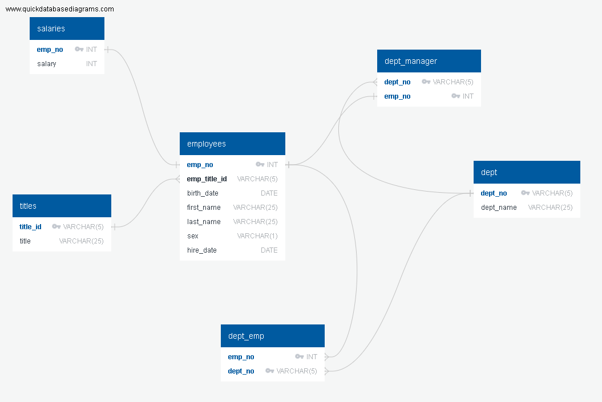

#### Data Engineering
dept_emp
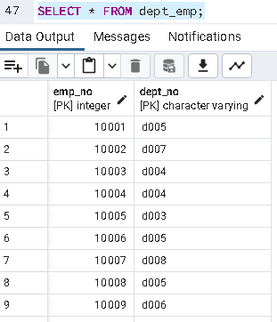

dept_manager
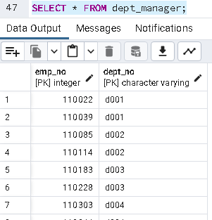

dept
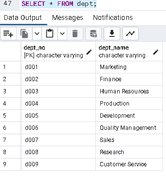

employees
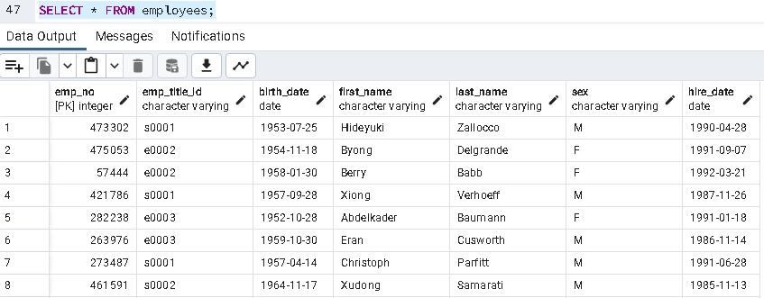

salaries
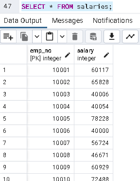

titles
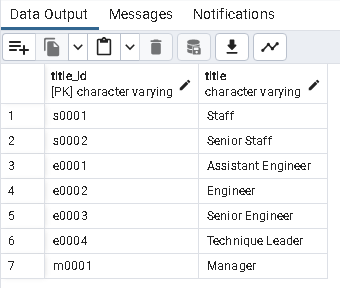

#### Data Analysis
-- List the employee number, last name, first name, sex, and salary of each employee.

-- List the first name, last name, and hire date for the employees who were hired in 1986.
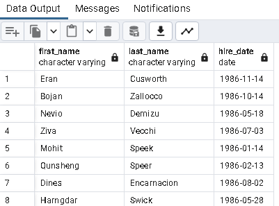

-- List the manager of each department along with their department number, department name, employee number, last name, and first name.
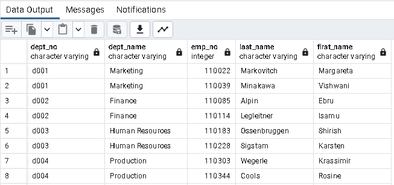

-- List the department number for each employee along with that employee’s employee number, last name, first name, and department name.

-- List first name, last name, and sex of each employee whose first name is Hercules and whose last name begins with the letter B.
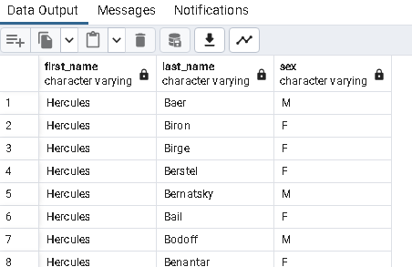

-- List each employee in the Sales department, including their employee number, last name, and first name.
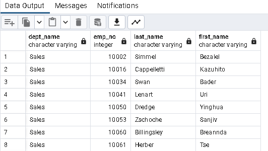

-- List each employee in the Sales and Development departments, including their employee number, last name, first name, and department name.

-- List the frequency counts, in descending order, of all the employee last names (that is, how many employees share each last name).
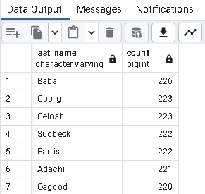
